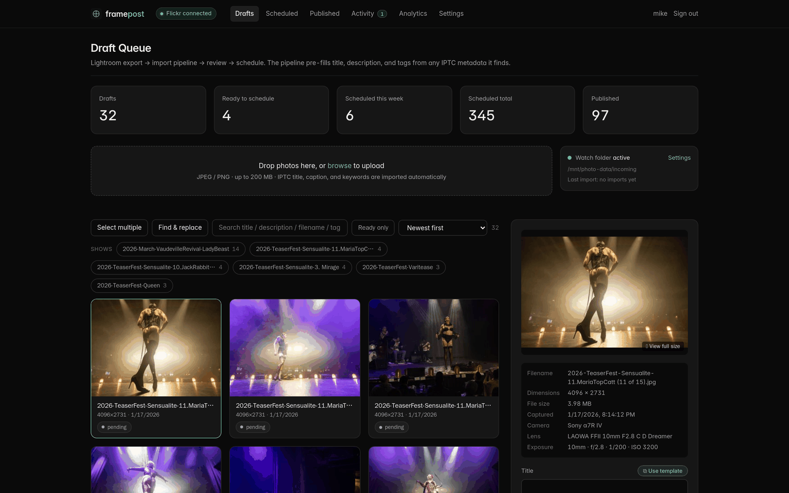
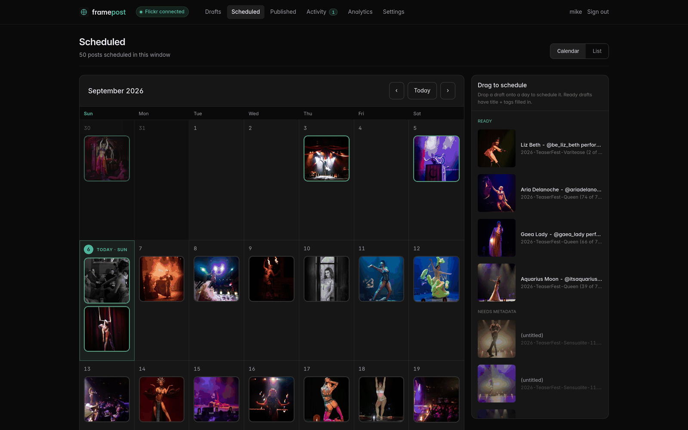
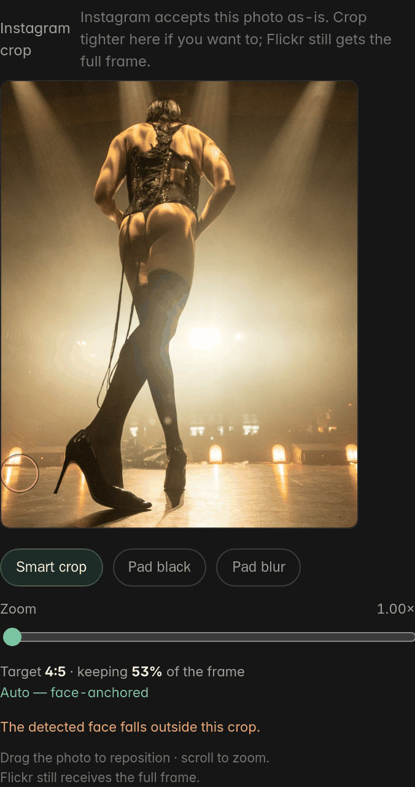
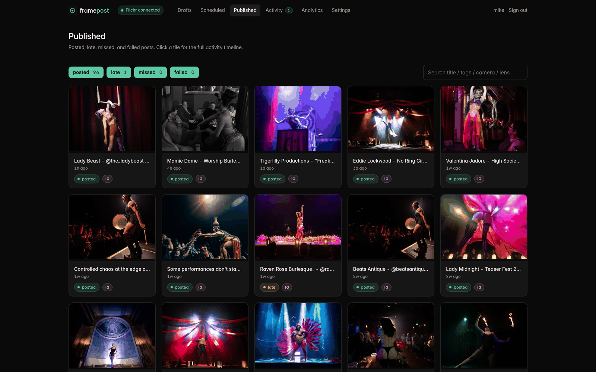
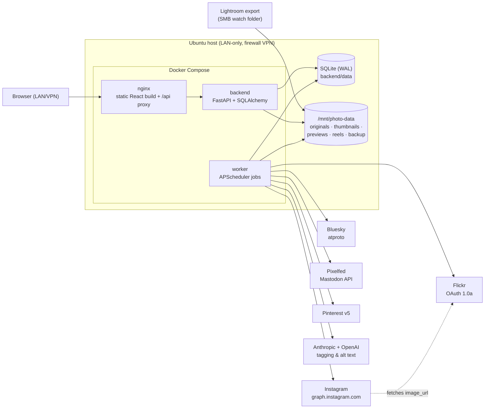

# FramePost

Self-hosted photo scheduler and multi-platform poster for
[Darrell Miller Photography](https://www.flickr.com/photos/darrellmillerphotography/).
Single-user, single-host, runs on a local Ubuntu box behind the photographer's
network perimeter.



## What it does

- **Watch-folder import** from a Lightroom export over a Samba share. Photos
  picked up automatically, IPTC metadata pre-filled, AI tagging via Anthropic
  Haiku + OpenAI GPT-4o-mini for caption and tag suggestions, and a background
  sweep that generates **alt text** for every photo that lacks it.
- **Scheduled posting to Flickr** with album and group fan-out, EXIF/ICC/XMP
  preservation through Pillow re-encode, and an OAuth 1.0a hand-rolled signer.
- **Fully automated fan-out** to **Bluesky** (atproto), **Pixelfed**
  (Mastodon-compatible API), **Pinterest** (v5 pins with Flickr referral
  links), and **Instagram** (Graph API "Instagram API with Instagram Login" —
  container publishing, no manual steps). Per-platform retry queues and
  per-post target opt-out.
- **Instagram crop studio** — photos outside IG's feed range get a
  face-anchored smart crop (or pad / blurred-pad), staged as a hidden
  machine-tagged Flickr photo for Meta's URL ingest and deleted after publish.
  The editor shows the real crop on a drag-and-zoom canvas, with a marker for
  the detected face that turns red and pins to the nearest edge when the face
  would fall outside the frame. A filmstrip applies the same treatment to a
  whole multi-selection in one pass. Flickr always receives the full frame.
  The pipeline probes empirically whether Meta accepts 3:4 and remembers.
- **Automatic Instagram collaborators** — performers tagged on a post (from
  Lightroom `@keywords`) are sent as co-authors, up to Meta's limit of 3. An
  accepted invite puts the photo on the performer's profile and in their
  followers' feeds. If Meta refuses a handle the post still ships: the
  offending handle is dropped, the retry goes out without it, and the
  performer is flagged in Settings as needing a handle check.
- **Show/batch workflow** — drafts group into per-show batches derived from
  the Lightroom export filename pattern; one chip click selects the whole
  show for Bulk Edit (shared venue / show / city / performers / targets) and
  Smart Fill scheduling.
- **Smart Fill scheduling** — sequential cadence, or **stratified random
  scatter** across the next 12 months: one horizon segment per photo, a
  random day inside each, at posting hours **learned from the account's own
  engagement history** (with a fixed fallback until there's data). Density is
  tiered — every day in the horizon gets one post before any day gets a
  second — so a 50-photo show never clumps. Schedule fuzz keeps timestamps
  human-looking.
- **Copy-paste assist** for Reddit (title + 2048-px image + subreddit
  shortcuts). The old Instagram assist remains as a fallback when the IG
  connection is absent.
- **Reels builder** — silent 1080×1920 MP4s from up to 10 stills via ffmpeg
  (per-photo 9:16 crop, Ken Burns zoom, director mode for hero shots).
- **Activity feed** unifying comments and likes from Flickr / Bluesky /
  Pixelfed plus Instagram engagement (auto-synced counts rendered as
  `▲ +N likes` delta items; comment text syncs once the Meta app is in Live
  mode).
- **Performer & venue tagging** — lightweight entities with IG handles;
  captions auto-insert `@mentions` and sanitized `#hashtags` per platform.
- **Camera info in captions** — an opt-in `Sony α7R IV · FE 24mm F1.4 GM ·
  24mm · f/2 · 1/250s · ISO 3200` line, appended to the description so it lands
  ahead of the hashtag block. On by default, switchable per post. Skipped on
  Bluesky, whose 300-character budget is worth more as hashtags, and on Flickr,
  which renders EXIF in its own panel already.
- **Caption de-duplication** — the AI tagger tends to write the description as a
  reworded title, so captions used to say the same sentence twice. Titles are
  compared against the description by significant word overlap and dropped when
  redundant; Flickr and Pinterest keep theirs, since those have real title
  fields.
- **Cross-platform analytics** that compare posts at equal **age** (24h / 48h
  / 7d windows) rather than lifetime totals — with a 12-month scatter, lifetime
  numbers just rank by how long a photo has been up. Per-platform quality
  scoring weights the actions that cost the viewer something (saves, shares,
  follows) above likes, plus leaderboards by performer / venue / show / city,
  an Instagram account trend, and collaborator lift.
- **Find & replace** across drafts *and* scheduled posts — fix a typo copied
  into twenty descriptions without flattening them, with a preview of every
  hit before anything is written. Published posts are reported but never
  edited; they are already live elsewhere.
- **Title templates**, **tag profiles**, **drag-to-schedule** calendar,
  **bulk edit**, scheduled **list view**, **ready-to-schedule checklist**,
  health banner with platform-token expiry warnings, daily orphan scanner
  reconciling disk ↔ DB.

## Screens

Scheduling. Smart Fill scatters a show across the horizon; drafts can also be
dragged onto a day. Density is tiered, so no day doubles up until every day has
one.



The Instagram crop studio. The photo is out of IG's feed range, so the crop is
face-anchored — and here the detected face falls outside the chosen window, which
the studio says in as many words rather than silently cropping a head off.



Published posts, with per-platform status.



## Architecture



The worker owns every minute-cron and daily job: due-post firing, platform
retries, group submission, engagement/comment sync, Instagram token refresh,
alt-text sweep, cleanup + hot backup, orphan scans. See
[docs/architecture.md](docs/architecture.md) for the post lifecycle and the
Instagram pipeline in detail.

## Stack

- **Backend**: Python 3.12 + FastAPI + SQLAlchemy 2.0 + Alembic (schema at
  migration `0021`)
- **Database**: SQLite (WAL mode) on the OS disk
- **Scheduler**: APScheduler in a sidecar worker process (MemoryJobStore —
  the DB is the source of truth)
- **Watch folder**: watchdog with the polling observer (reliable over SMB)
- **Image**: Pillow 11 + piexif + IPTCInfo3 + exiftool fallback + OpenCV
  (face-anchored crops) + ffmpeg (Reels)
- **Frontend**: React 19 + TypeScript + Vite + TanStack Query
- **Crypto**: Fernet via `cryptography` for OAuth-token-at-rest
- **Web tier**: nginx (multi-stage Docker build bundles the frontend)
- **Tests**: pytest — `docker compose exec backend python -m pytest tests/ -q`
- **Deployment**: Docker Compose (backend, worker, nginx)

## Layout

```
backend/      FastAPI app, SQLAlchemy models, Alembic migrations,
              services (image, AI, scheduler, watcher, ig_variant,
              alt_text, comments, platforms/*), pytest suite in tests/
frontend/     React app — pages, components, API client
nginx/        Multi-stage Dockerfile that builds the frontend and serves it
docs/         Architecture, setup, Instagram integration, restore runbooks,
              roadmap, screenshots
brief.md      The original project brief that this codebase implements
```

## Configuration

Secrets live in `/opt/framepost/.env` (mode 600, gitignored). See
`.env.example` for the shape. The minimum set is:

- `SECRET_KEY` — session signing
- `TOKEN_ENCRYPTION_KEY` — Fernet key for OAuth-token-at-rest
- `FLICKR_API_KEY` / `FLICKR_API_SECRET`
- `ANTHROPIC_API_KEY` / `OPENAI_API_KEY` (optional — disables AI tagging and
  the alt-text sweep if absent)

Per-platform credentials (Bluesky app password, Pixelfed OAuth, Pinterest
OAuth, the Instagram long-lived token) are entered through Settings →
Platforms and stored Fernet-encrypted in the `platform_credentials` table.
Instagram setup — the Meta app, tester role, and token walkthrough — is
documented step-by-step in [docs/instagram.md](docs/instagram.md).

## Status

Production single-user deployment since early 2026. All five platforms post
fully automatically and the scheduler learns posting hours from realized
engagement. The pytest suite (133 tests) guards the scheduling, caption,
tag-normalisation, image-geometry, crop-rect, collaborator fail-soft, and
find & replace logic, plus a route-inventory check that fails if a literal path
is ever declared behind the `/{post_id}` catch-all again.

## Roadmap

Deferred work — what's next, what's blocked and why, and what was consciously put
down — lives in [docs/roadmap.md](docs/roadmap.md). It carries the findings behind
each item (for example, what Meta's API will and won't do for carousels and
collaborators) so nothing has to be rediscovered.

## Privacy

See [PRIVACY.md](PRIVACY.md). FramePost is self-hosted; the maintainer does
not operate any servers and does not receive any user data.

## License

MIT — see [LICENSE](LICENSE).
