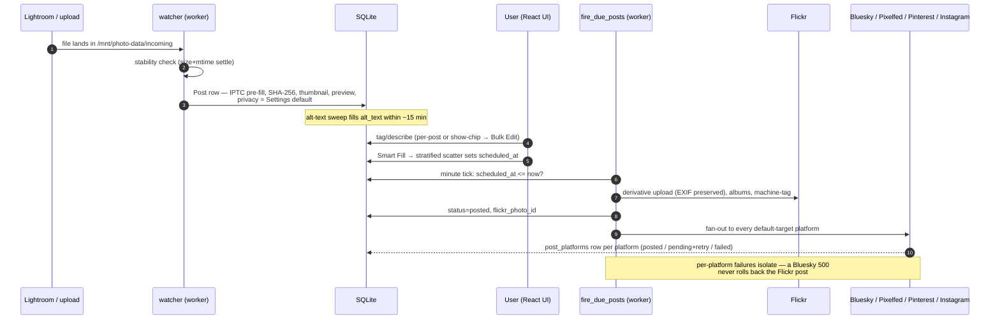
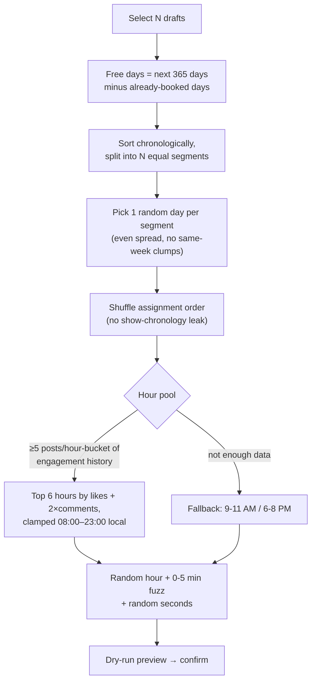
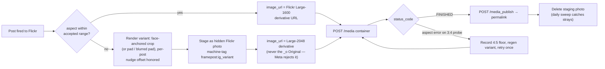

# FramePost — Architecture

How a photo travels from a Lightroom export to five platforms, and which
process owns each step. Companion to the top-level README; the Instagram
specifics live in [instagram.md](instagram.md).

## Processes

Three containers share one SQLite database (WAL mode) and one photo volume:

| Container | Role |
|---|---|
| `nginx` | Serves the built React app, proxies `/api` to the backend |
| `backend` | FastAPI — auth, CRUD, uploads, previews, on-demand renders |
| `worker` | APScheduler — everything time-driven (below) |

The worker's job table (all registered in `services/scheduler.py`):

| Job | Cadence | What it does |
|---|---|---|
| `heartbeat` | 1 min | Stamps `app_config.worker_last_heartbeat` — `/health` degrades if stale |
| `fire_due_posts` | 1 min | Scans for `scheduled_at <= now`, posts to Flickr, then fans out |
| `retry_platform_posts` | 1 min | Re-attempts `post_platforms` rows whose backoff timer elapsed (also powers the UI "Post now" button) |
| `submit_due_groups` | 1 min | Flickr group-pool submissions with per-group tracking |
| `fill_missing_alt_text` | 15 min | AI alt text for any post lacking it (new imports + back catalog) |
| `daily_flickr_sync` | daily | Pulls the account's Flickr photos into the machine-tag cache (duplicate layer 2) |
| `comments/engagement sync` | daily | Comments + likes from Flickr/Bluesky/Pixelfed; counts + comments from Instagram |
| `daily_instagram_token_refresh` | daily | Refreshes the IG token inside its 7-day leeway window |
| `daily_cleanup` | daily | SQLite hot backup + rotation, original purge past retention, reel purge, IG staging-variant sweep, disk↔DB orphan scan, WAL checkpoint |

## Post lifecycle

State machine for `Post.status`: `pending` → (`scheduled_at` set — still
`pending`) → `posted` | `late` (fired >5 min behind) | `missed` (>24 h,
needs manual re-queue) | `failed` (retries exhausted). Non-Flickr outcomes
live per-platform in `post_platforms.status` with their own retry backoff.

## Scheduling: stratified scatter + learned hours

Later batches stratify over the *remaining* free days, so successive shows
interleave instead of stacking. The learned pool recomputes from
`engagement_snapshots` on every run and is surfaced by
`GET /api/schedule/popular-hours`.

## Instagram pipeline (summary)

Full detail, constraints, and the empirical findings (3:4 acceptance,
`_o` URL rejection, dev-mode comment filtering) in
[instagram.md](instagram.md).

## Engagement + activity

Daily sync (`services/comments.py`) writes three tables the UI reads:

- `post_comments` — real comment rows, deduped by `(platform, remote_id)`,
  `seen_at` powers the unread badge
- `post_likes` — per-user likes where the platform exposes them (Flickr,
  Bluesky, Pixelfed; Instagram never does)
- `engagement_snapshots` — append-only count series per (post, platform);
  powers analytics, the learned scheduler hours, and the Activity stream's
  synthesized Instagram `▲ +N likes · +M comments` delta items

## Safety nets

- **Duplicates**: SHA-256 at import (layer 1) + Flickr machine-tag cache
  (layer 2) + soft title/date/dims warning
- **Backups**: nightly SQLite hot backup with 7/4/3 rotation to
  `/mnt/photo-data/backup` (off-host replication is the known open item —
  see [restore.md](restore.md))
- **Orphan scan** (daily): files without DB rows quarantine to
  `errors/orphans/`; posted photos missing their permanent thumbnail are
  flagged loudly
- **Token health**: `/health` carries `platform_warnings`; the UI banner
  fires when a token is expired or auto-refresh has been failing for days
- **Tests**: `backend/tests/` — scheduling math, caption building, hashtag
  legality, IG crop geometry. Run inside the container:
  `docker compose exec backend python -m pytest tests/ -q`
